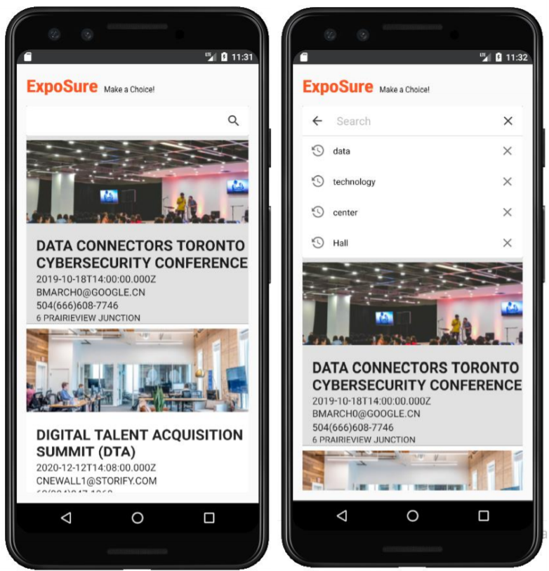

# ExpoSure

## Introduction

ExpoSure is an app for businesses, event organizers and visitors alike. Events are listed together
with details such as location and dates giving businesses the ability of displaying their products
to visitors. Visitors can save a product to favorites before hand so that they get to have a
shortlist of their coveted products to see during the event. This way they will know the booth
number associated with their favorite products saving time and focusing on what matters.
Moreover, they can use their cameras to quickly add products to their favorite list on location.
Organizers can coordinate with businesses making event guides that help visitors find booths
they desire.

## System Architecture 

## Mockup

## Functionality (The app is divided into three work flows)

### Organizers

The Organizer role is to create events. They can view a list of events. Also, organizers have the
ability to create businesses and add them to events.

### Businesses

Businesses can create products but cannot create events. Each product can be identified by a
QR-Code. They can view a list of all their products.

### Visitors

Visitors are the main focus of this app; they are capable of viewing events in a list. Each event
informs the visitor of the venue’s location and event date. They can browse for businesses
enrolled in events and furthermore, browse the products belonging to each business. They can
do this beforehand. This way they can plan their visit carefully ahead of time. Visitors can also,
use their phone cameras to scan a QR-Code sticker provided by the business owners to add
their chosen products to favorites.

## UML Diagram

## Entity Relationship Diagram

## Backend Code Snippet

## Application Screenshots

